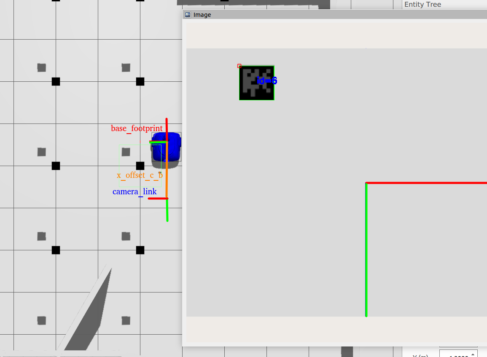

# ArUco Pose Estimation

[](https://docs.ros.org/en/humble/index.html)
[](https://releases.ubuntu.com/jammy/)
[](link)

## Abstract

This ROS 2 package provides tools for robot pose estimation using ArUco markers. It detects markers from a camera feed and computes the robot's global pose based on a known marker map (grid layout). Additionally, it includes a correction mechanism to re-localize AMCL if its estimate diverges significantly from the visual pose estimation.

**_This repo was tested on Ubuntu 22.04 LTS with ROS Humble._**



----

## Features

- **Visual Pose Estimation**: Computes robot pose in the `world` (or `odom`) frame using a ceiling-mounted or environment-fixed grid of ArUco markers.
- **Dual Input Support**: Can acquire images directly from a camera device (port) or subscribe to a ROS 2 image topic.
- **AMCL Correction**: Automatically triggers an `initialpose` publication to re-align AMCL when it drifts away from the ground-truth visual estimate.
- **Configurable Marker Map**: Supports customizable grid layouts (rows, columns, separation, and origin offsets).
- **Debug Visualization**: Optional debug image output showing detected markers and camera axes.

----

## Table of Contents

- [Requirements](#requirements)
- [Installation](#installation)
- [Project Structure](#project-structure)
- [Usage](#usage)
- [Configuration](#configuration)
- [Nodes](#nodes)
- [Credits](#credits)
- [License](#license)

---

## Requirements

### Software
- **Operating System**: Ubuntu 22.04 LTS
- **Middleware**: ROS 2 Humble
- **Dependencies**:
  - `OpenCV` (with `aruco` module)
  - `cv_bridge`
  - `image_transport`
  - `tf2` and `tf2_geometry_msgs`

---

## Installation

1. **Clone the repository** into your colcon workspace:

```bash
cd ~/colcon_ws/src
git clone <repository-url>
```

2. **Install dependencies**:

```bash
cd ~/colcon_ws
rosdep install --from-paths src --ignore-src -r -y
```

3. **Build the package**:

```bash
colcon build --packages-select aruco_pose_estimation
source install/setup.bash
```

---

## Project Structure

```text
aruco_pose_estimation/
├── config/
│   └── aruco_estimator.yaml      # Node parameters and marker map configuration
├── launch/
│   └── aruco_estimator_launch.py # Launches nodes
├── src/
│   ├── visual_pose_estimator.cpp # Main node for pose estimation
│   └── marker_pose_corrector.cpp # Node for AMCL divergence correction
├── CMakeLists.txt
└── package.xml
```

---

## Usage

To start the visual pose estimator node and the pose corrector node (AMCL re-localization), with the default configuration:

```bash
ros2 launch aruco_pose_estimation aruco_estimator_launch.py
```


---

## Configuration

Parameters are managed via `config/aruco_estimator.yaml`. Key parameters include:

- `marker_size`: Physical size of the ArUco marker (meters).
- `ceiling_height`: Height of the marker grid relative to the world origin.
- `rows` / `cols`: Grid dimensions.
- `separation_x` / `separation_y`: Distance between markers in the grid.
- `image_topic`: Input image topic (if `camera_port` is -1).
- `debug`: Enable/disable debug image publishing.
- `x_offset_c_b`: X offset of up camera with respect to base_footprint frame.
- `distance_tolerance`: Distance tolerance for AMCL correction.
- `orientation_tolerance`: Orientation tolerance for AMCL correction.

---

## Nodes

### `visual_pose_estimator` (in simulation)
- **Subscribes to**: `image_topic` (sensor_msgs/Image), `camera_info_topic` (sensor_msgs/CameraInfo).
- **Publishes**: `visual_robot_pose` (geometry_msgs/PoseStamped), `~/debug_markers` (sensor_msgs/Image).

### `marker_pose_corrector`
- **Subscribes to**: `amcl_robot_pose` (geometry_msgs/Pose), `visual_robot_pose` (geometry_msgs/PoseStamped).
- **Publishes**: `initialpose` (geometry_msgs/PoseWithCovarianceStamped).

---

## Credits

+ **Author:** Cruz Mauricio Artega Escamilla
+ **Maintainer:** Cruz Mauricio Artega Escamilla

---

## License

This project is licensed under the Apache License 2.0.
