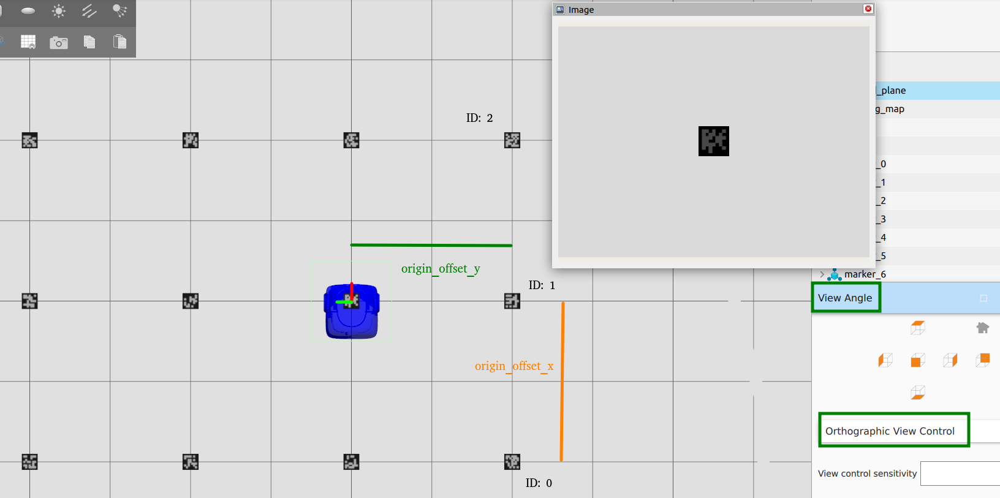

# markers_cluster_gz

A ROS 2 package for spawning a grid-based cluster of ArUco markers in the Gazebo (Ignition) simulator.

## Description

The `markers_cluster_gz` package provides a utility to automatically spawn multiple ArUco markers in a Gazebo Ignition environment. It is designed to facilitate testing and validation of marker-based localization and computer vision algorithms by allowing quick generation of large, organized patterns of markers with configurable properties.



## Features

- **Grid Spawning**: Easily create an $N \times M$ grid of markers.
- **Configurable Spacing**: Define separation distances in both X and Y axes.
- **Custom IDs**: Specify the starting ID for the ArUco markers in the cluster.
- **Dynamic Orientation**: Markers are spawned facing downwards (Pitch = $\pi$) for overhead camera detection.
- **YAML Configuration**: All parameters can be tuned via a central configuration file.
- **Mobile robot with camera**: not include in this package.

## Prerequisites

- **ROS 2**: (Tested on Humble)
- **Gazebo Ignition**: (Fortress or newer)
- **ros_gz**: Bridges and simulation plugins for Gazebo Ignition.

## Configuration

Parameters are managed in `config/markers_cluster.yaml`.

| Parameter | Type | Default | Description |
| :--- | :--- | :--- | :--- |
| `marker_size` | float | 0.5 | Size of the marker side in meters. |
| `ceiling_height` | float | 3.0 | Altitude (Z-axis) at which markers are spawned. |
| `separation_x` | float | 2.0 | Distance between columns. |
| `separation_y` | float | 2.0 | Distance between rows. |
| `origin_offset_x` | float | -2.0 | X-offset for the first marker (column 0). |
| `origin_offset_y` | float | -2.0 | Y-offset for the first marker (row 0). |
| `rows` | int | 5 | Number of rows in the grid. |
| `cols` | int | 5 | Number of columns in the grid. |
| `start_id` | int | 0 | Starting ArUco ID for the sequence. |


## Usage

### 1. Build the Package

Before building, <span style="color:green">
for a correct images visualization, it required to set the USER in path of the 'markers_cluster_gz/models/marker/model.sdf', in 'albedo_map' tag.</span>

Ensure your workspace is sourced and build using `colcon`:

```bash
cd ~/colcon_ws
colcon build --packages-select markers_cluster_gz
source install/setup.bash
```

### 2. Launch the Spawner

First, ensure a Gazebo Ignition world is running. Then, launch the spawner node:

```bash
ros2 launch markers_cluster_gz markers_cluster.launch.py
```

> [!NOTE]
> The spawner node (`marker_spawner`) performs its task during initialization and then shuts down. It uses the `ros_gz_sim create` service to instantiate markers in the simulator.

## Marker Orientation

The markers are spawned with a Pitch of $\pi$ (180 degrees) relative to the world frame. This means the ArUco pattern faces the ground (-Z direction), which is ideal for robots equipped with upward-facing cameras or for simulating ceiling-mounted markers.

## Dependencies

This package relies on the `marker` model being available in the `GZ_SIM_RESOURCE_PATH`. The launch file automatically configures this environment variable to search within the package's `models` directory.
